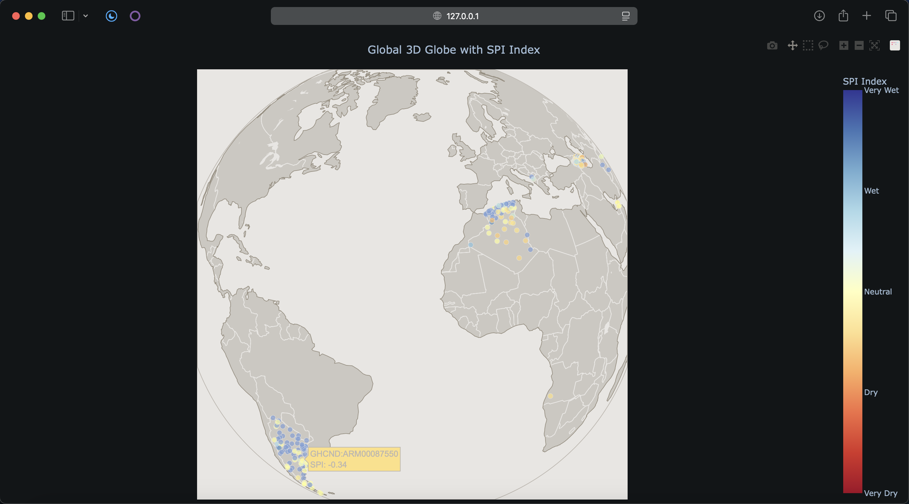

# Drought Analyzer

Welcome to Drought Analyzer! It scrapes data from the NOAA to determine the SPI index at each of its stations, and then plots it onto an interactive globe in your browser.

NOTE: You will need a NOAA NCDC Web Service Key Token in order to scrape the data for the program (see `api.py`).

If you don't have/want to use an API key, I have some pre-scraped data (from the years 1980-2022) saved in the `data` folder. Delete lines 5 to 24 in `main.py` to see the plot generated by this data.